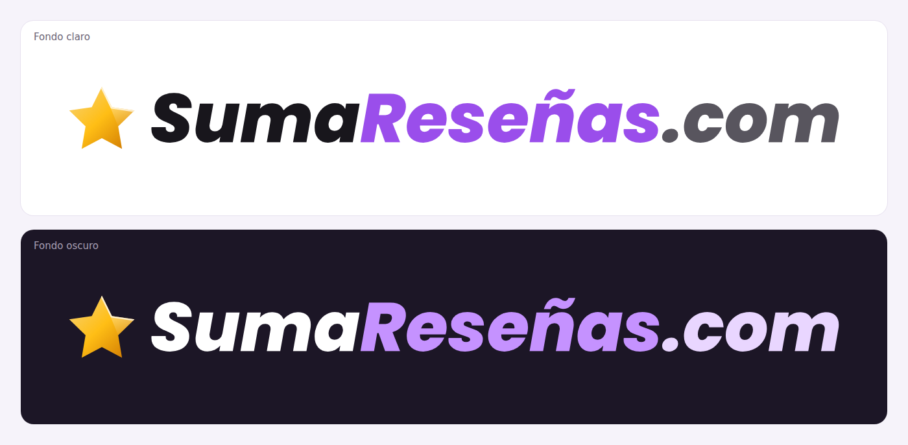

# Logo ⭐ SumaReseñas.com

## Logo oficial (por ahora)

Es la propuesta 09b: Poppins ExtraBold Itálica con la estrella dorada.
Los archivos están en [`oficial/`](oficial/):

| Archivo | Uso |
| --- | --- |
| `sumaresenas-logo-fondo-claro.png` | PNG transparente de 3000 px de ancho, para fondos claros |
| `sumaresenas-logo-fondo-oscuro.png` | PNG transparente de 3000 px de ancho, para fondos oscuros |
| `sumaresenas-logo-fondo-claro.svg` y `sumaresenas-logo-fondo-oscuro.svg` | Vectoriales, para imprenta y placas |

**Tipografía:** Poppins ExtraBold Itálica (Google Fonts, licencia SIL Open
Font License).

| Elemento | Fondo claro | Fondo oscuro |
| --- | --- | --- |
| “Suma” | `#18161c` | `#ffffff` |
| “Reseñas” | `#9a4eeb` | `#c592ff` |
| “.com” | `#58555e` | `#e9d6ff` |
| Estrella (degradado) | `#f6d480` → `#ffbe15` → `#cb7300` | Igual |

## Propuestas

Doce propuestas: la tipografía en cursiva con una estrella antes. Los colores
salen de la paleta del sitio (violeta y dorado).

Cada propuesta viene en cuatro archivos:

| Archivo | Uso |
| --- | --- |
| `png/NN-nombre.png` | PNG transparente de 3000 px de ancho, para fondos claros |
| `png/NN-nombre-fondo-oscuro.png` | Versión con letras blancas, para fondos oscuros |
| `svg/NN-nombre.svg` y `svg/NN-nombre-fondo-oscuro.svg` | Vectoriales, con las letras convertidas a trazos: se escalan sin perder calidad y no hace falta tener la fuente instalada (sirven para imprenta y placas) |

| # | Tipografía | Estilo | Estrella |
| --- | --- | --- | --- |
| 01 | Pacifico | Amigable y redondita | Dorada con relieve |
| 02 | Dancing Script (Bold) | Elegante casual, dos tonos | Dorada lisa |
| 03 | Great Vibes | Caligrafía fina | Dorada en degradado |
| 04 | Yellowtail | Retro de los 50 | Dorada inclinada |
| 05 | Kaushan Script | Trazo de pincel | Ámbar inclinada |
| 06 | Norican | Clásica y muy legible | Dorada facetada |
| 07 | Yesteryear | Vintage con fuerza | Dorada con relieve |
| 08 | Playfair Display (Black Italic) | Editorial, premium | Dorada fina |
| 09 | Poppins (ExtraBold Italic) | Moderna | La estrella lila del sitio actual |
| **09b** | **Poppins (ExtraBold Italic)** | **Moderna — oficial** | **Dorada facetada** |
| 10 | Courgette | Suave, con un “+” de *sumar* | Dorada con “+” |
| 11 | Style Script | Tipo firma | Dorada delineada |
| 12 | Grand Hotel + Poppins | Script con “.com” en letra de palo | Dorada con relieve |

Colores principales: violeta `#672fa5` / `#803acd` / `#9a4eeb`, violeta oscuro
`#31134e`, estrella `#ffbe15`, dorado `#cb7300` (sobre claro) y `#f2b95a`
(sobre oscuro).

Todas las tipografías son de Google Fonts, con licencia SIL Open Font License
(Yellowtail: Apache 2.0): se pueden usar gratis en un logo comercial.
